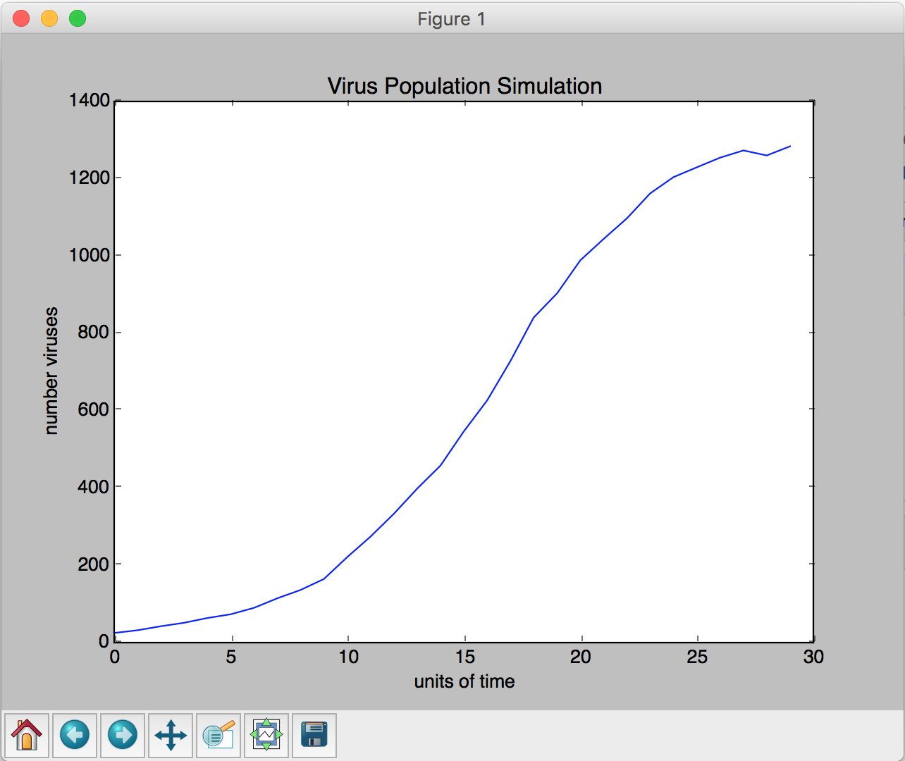
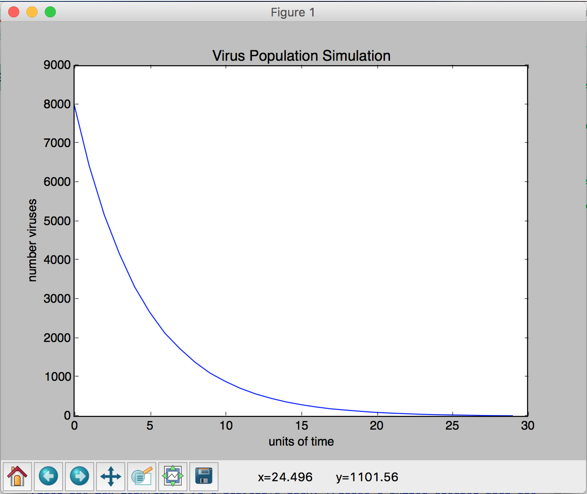

# Virus Project
Simulation of a virus. Follows mathematical trends of exponential population growth based on given data values.
To try it out, simply run the program and input values as you see fit. I would recommend a small starting population,
a large maximum population, a high reproduction rate, a low mortality rate, and a greater number of trials. But feel 
free to tinker with these values and study the graphs as necessary. Use the command `python3 virus.py` to try it out!

=========================================

Sample Simulations:

